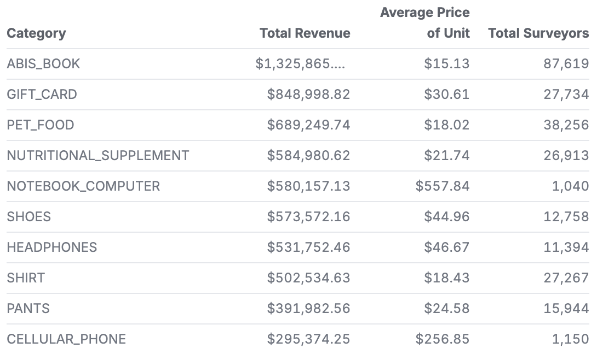
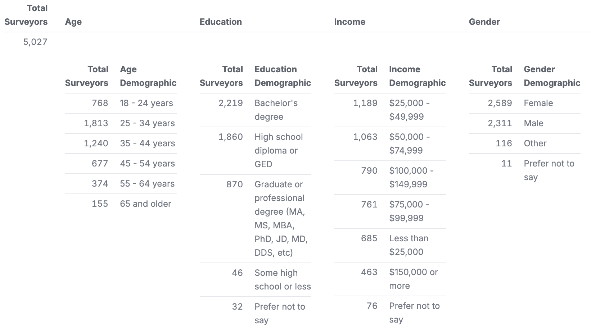
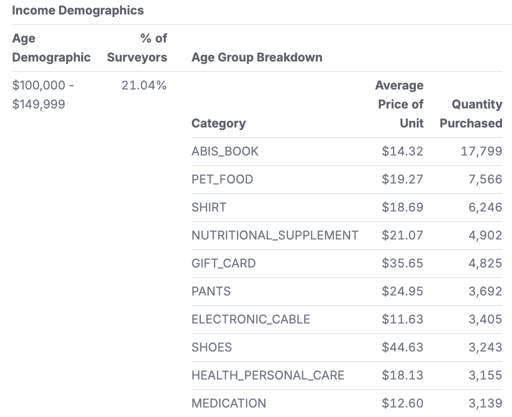
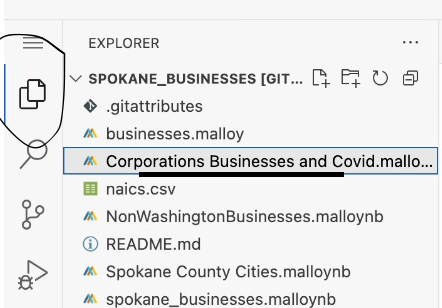

# Analysis of Amazon Survey Purchases

In this analysis, I looked at a dataset which includes records of purchases made on Amazon. More specifically, these purchases were made by buyers who have answered surveys. With that, this data comes with another file detailing what the users submitted in their survey responses.

The goal of this analysis is find customer trends and gain a better understanding of the consumer base of Amazon.

# What Is In The Data?

The [main file](amazon-purchases.csv) used in this analysis is fairly straightforward; it contains a list of purchase records along with other relevant information such as:
* Category of the item
* Order date
* Purchase price
* Shipping address state
* Full Title of the item

The [secondary file](survey.csv) is the survey file mentioned earilier with information provided by users who have filled out a survey. This file includes the survey submitter's:
* Income level
* Age group
* Race
* Gender
* State of residence
* Other miscellaneous descriptors

# What Was Done In The Analysis

The first few queries were primarily done to ground myself in the data and get a basic understanding of what I was looking at. Further on in my analysis, I delve deeper into the details, ultimately breaking down the purchases by each demographic as the crux of the analysis. To give some examples, here are some of the visualizations made in the analysis:

With this first query, we can see at a very high level what most customers are buying. While it does not breakdown any of the data by any demographic, this trend of items being at the tops stays fairly consistent throughout the course of this analysis.

  

This next query juxtaposes the previous query by ignoring the purchases/revenues and strictly looks at the breakdown of survey submitters via demographic. Do note that there are more tables in this query, however they were unable to fit in this image capture.

  

As a sneak peak to the final visualization, here is a section of the query showing the most purchased items from customers in the $100,000-149,999 income range. The rest of the visualization not only shows the top items of the other income levels, but of the other demographics as well.

  

## Directions on how to use the github web editor to run the same analysis
Because of the size of the data, you first must go to the [this](https://dataverse.harvard.edu/dataset.xhtml?persistentId=doi:10.7910/DVN/YGLYDY) link and download the data from the Harvard Dataverse Website. Once you have downloaded the data, you should be able to import it into the Virtual Studio Code environment and press the period key to run it. This will load the web editor. Then install the malloy extension. See images below for reference:

| **Step**   | **Image Preview** |
|--------|-----------|
| `Step 1 - Press allow` |  |
| `Step 2 - Click the Blocks, search for Malloy, install` |  |
| `Step 3 - Click Trust` |  |
| `Step 4 - Click a .malloynb file` |  |
| `Step 5 - Press Run` |  |

NOTE: If you are having issues seeing the images, you can more clearly see them by selecting these:
* [Step 1](step1.png)
* [Step 2](step2.png)
* [Step 3](step3.png)
* [Step 4](step4.png)
* [Step 5](step5.png)